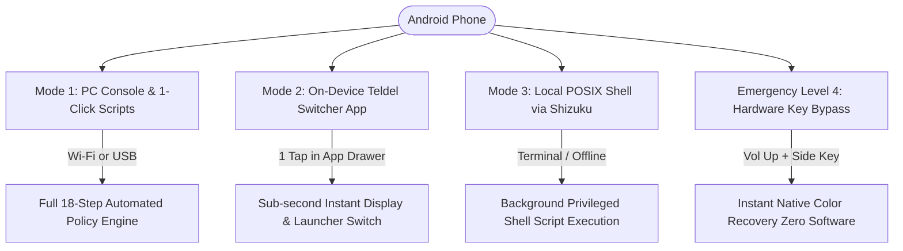
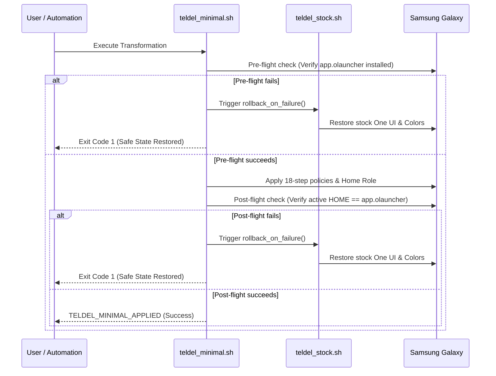

# teldel — Complete User Guide & Operational Manual

Welcome to the definitive user guide for **teldel** (Android Productivity Terminal & Dopamine Detox Suite). This document provides an exhaustive, step-by-step manual explaining how to configure, operate, switch, and troubleshoot every component and automation tool available in the project.

---

## Table of Contents

1. [System Philosophy & Safety Guarantees](#1-system-philosophy--safety-guarantees)
2. [First-Time Device Preparation (5-Minute Walkthrough)](#2-first-time-device-preparation-5-minute-walkthrough)
3. [The Three Operational Modes](#3-the-three-operational-modes)
   - [Mode 1: PC Management Console & 1-Click Scripts (Wi-Fi / USB)](#mode-1-pc-management-console--1-click-scripts-wi-fi--usb)
   - [Mode 2: Autonomous On-Device Switcher App (Teldel Switcher APK)](#mode-2-autonomous-on-device-switcher-app-teldel-switcher-apk)
   - [Mode 3: Autonomous On-Device POSIX Shell (Shizuku + Rish)](#mode-3-autonomous-on-device-posix-shell-shizuku--rish)
   - [Emergency Level 4: Native Physical Hardware Button Bypass](#emergency-level-4-native-physical-hardware-button-bypass)
4. [Master Console (phone_manager.bat) Feature Matrix](#4-master-console-phone_managerbat-feature-matrix)
5. [Fast 1-Click Automated Batch Files](#5-fast-1-click-automated-batch-files)
6. [Wireless ADB Guardian & Cable-Free Networking](#6-wireless-adb-guardian--cable-free-networking)
7. [Transactional Safety & Automatic Self-Healing Rollback](#7-transactional-safety--automatic-self-healing-rollback)
8. [App Usage Analytics & Dopamine Auditing](#8-app-usage-analytics--dopamine-auditing)
9. [Frequently Asked Questions & Troubleshooting](#9-frequently-asked-questions--troubleshooting)

---

## 1. System Philosophy & Safety Guarantees

Modern smartphones are engineered around continuous sensory stimulation: vibrant OLED saturation, infinite algorithm-driven recommendation feeds, notification badges, and rapid micro-animations. 

**teldel** strips away the addictive psychological triggers while transforming your Samsung Galaxy or Android device into a lightning-fast, distraction-free productivity terminal:

* **Zero Root Privileges Required**: All operations run using standard Android OS user-space management interfaces (`settings`, `cmd role`, `cmd appops`, `pm`).
* **Samsung Knox 0x0 Untouched**: No bootloader unlocking, no kernel flashing, no custom recovery. Knox hardware fuses remain pristine, maintaining enterprise and banking security integrity.
* **Preserved Essential Perimeter**:
  * Incoming & outgoing Phone calls, SMS, and emergency services remain 100% untouched.
  * Direct messaging (Telegram, WhatsApp, Signal, Viber, Discord) continues functioning normally.
  * Push alerts in the notification shade display full text and interactive buttons.
  * Mobile banking (Monobank, Privat24, Raiffeisen, etc.) and Two-Factor Authentication apps (Google Authenticator, Bitwarden, etc.) run with full hardware security.
  * Camera captures original high-resolution, full-color photos.
* **100% Reversible**: Return to standard Samsung One UI defaults at any moment with a single click or tap.

---

## 2. First-Time Device Preparation (5-Minute Walkthrough)

To allow the automation scripts to communicate with your device, you only need to perform a one-time setup:

### Step 2.1: Enable Developer Options
1. On your phone, open **Settings** > **About phone** > **Software information**.
2. Tap **Build number** 7 times consecutively until a toast message announces *"Developer mode has been enabled"*.
3. Return to the main **Settings** menu and scroll to the very bottom to find **Developer options**.

### Step 2.2: Enable USB Debugging
1. Open **Developer options**.
2. Scroll down to the **Debugging** section and toggle **USB debugging** to **ON**.
3. (Optional but recommended for Android 11+): Toggle **Wireless debugging** to **ON**.

### Step 2.3: Initial PC Authorization
1. Connect your phone to your PC via a USB cable.
2. A pop-up dialog will appear on your phone screen: *"Allow USB debugging?"*.
3. Check the box **Always allow from this computer** and tap **Allow**.

---

## 3. The Three Operational Modes

`teldel` provides three completely independent ways to toggle between **Minimal Productivity Mode** and **Default Stock One UI Mode**.



---

### Mode 1: PC Management Console & 1-Click Scripts (Wi-Fi / USB)

Best suited when working at your computer. Does not require keeping the phone connected to a cable once wireless mode is armed.

* **Main Entry Point**: Double-click `phone_manager.bat` in the root folder.
* **Autonomous Wi-Fi Auto-Discovery**: If no USB cable is connected, the scripts automatically locate your phone over your local Wi-Fi network using zero-configuration mDNS and ARP subnet discovery. You never have to configure IP addresses manually.

---

### Mode 2: Autonomous On-Device Switcher App (Teldel Switcher APK)

Best suited for daily use when away from your PC. Two native application icons appear directly in your app drawer:

1. **"Switch to Stock"** (One UI icon):
   * Instantly restores full-color display (disables monochrome, disables Daltonizer, turns off Extra Dim).
   * Restores default 1.0x window, transition, and animator durations.
   * Switches default home launcher back to Samsung One UI Home.
   * Unfreezes Google Play Store, Galaxy Store, Chrome, and system tools in the background.
2. **"Switch to Minimal"** (Terminal icon):
   * Instantly enables hardware monochrome and Daltonizer.
   * Activates Extra Dim white point reduction at 80% intensity.
   * Sets all system animation durations to 0.0 ms.
   * Switches default home launcher to Olauncher text interface.
   * Locks down browser and stores in the background.

#### Dual-Engine Architecture
* **Engine A (Direct Secure Settings)**: Uses granted `WRITE_SECURE_SETTINGS` permissions to toggle display colors, Extra Dim, and animations directly via Android's `ContentResolver`. Works instantaneously in less than 50 milliseconds. **100% reboot-proof** — never asks for wireless pairing codes or PC connections after phone restart.
* **Engine B (Shizuku Privileged IPC)**: If the Shizuku background service is active on device, deep package freezing (`pm disable-user`) and atomic home role switching execute seamlessly in the background without user interaction.

---

### Mode 3: Autonomous On-Device POSIX Shell (Shizuku + Rish)

For power users, terminal emulators (Termux), or automated shortcuts (Tasker, Automate):

* `/data/local/tmp/run_stock.sh`: Reverts the device to stock One UI via local Shizuku rootless shell.
* `/data/local/tmp/run_minimal.sh`: Applies the 18-step minimalism lockdown via local Shizuku rootless shell.

Scripts are pre-deployed to `/data/local/tmp/` with POSIX executable permissions (`chmod 755`).

---

### Emergency Level 4: Native Physical Hardware Button Bypass

If your PC is turned off, you have no internet/Wi-Fi, and Shizuku is inactive, Samsung One UI provides an emergency hardware button shortcut built into the device firmware:

1. Simultaneously press **Volume Up + Side (Power) Key**.
2. This toggles Samsung's native **Direct Access Accessibility Shortcut**, immediately bypassing Grayscale and Extra Dim to restore 100% color vision.
3. **One-Time Configuration**: Navigate to **Settings** > **Accessibility** > **Advanced settings** > **Side and Volume up keys** and ensure **Color adjustment** and **Extra dim** are selected.

---

## 4. Master Console (phone_manager.bat) Feature Matrix

When launching `phone_manager.bat`, an interactive diagnostic header displays real-time connection telemetry:

```text
================================================================
       ANDROID PRODUCTIVITY TERMINAL - PHONE MANAGER
================================================================
 [STATUS] Link: [Wi-Fi Wireless] | Bat: 100% | Mode: [MINIMAL TERMINAL]
          Screen: [B/W] | Store: [LOCKED] | DNS: [CleanBrowsing DoT]
================================================================
```

### Menu Options Breakdown:

* **`[1] Temporarily ENABLE Google Play Store`**:
  * Unfreezes Google Play Store (`pm enable com.android.vending`).
  * Use this when you need to install or update a required banking app, messenger, or work utility.
* **`[2] DISABLE Google Play Store`**:
  * Freezes Google Play Store (`pm disable-user --user 0 com.android.vending`).
  * Re-seals the perimeter so you cannot impulsively download games or social media apps.
* **`[3] Mirror Phone Screen to PC (scrcpy)`**:
  * Launches an ultra-low-latency screen mirroring window on your Windows desktop using `scrcpy`.
  * Allows typing with your physical PC keyboard and navigating with mouse clicks.
* **`[4] Toggle Display Mode: B/W <--> COLOR`**:
  * Instantly toggles between full 24-bit color and monochrome Gray Stone mode without changing any other apps or settings.
* **`[5] Express Battery, RAM & Security Perimeter Audit`**:
  * Performs an instant security check: verifies battery health, memory consumption, private DNS status, and verifies that sideloading vectors (`install_non_market_apps`) remain blocked.
* **`[6] Apply Full Minimalism Transformation`**:
  * Executes the complete 18-step transaction-safe payload (disabling entertainment feeds, locking sideloading, applying CleanBrowsing DNS, setting 0ms animations, and switching to Olauncher).
* **`[7] Collect Usage Statistics & Dopamine Addiction Audit`**:
  * Dumps Android `usagestats` service data and calculates lifetime screen time, app open counts, micro-checks, and binge sessions.
* **`[8] Open Interactive HTML Reports & Dashboard`**:
  * Opens the Chart.js visual dashboard in your default PC web browser (`docs/index.html`).
* **`[9] Restore Default Stock Android Settings (Rollback)`**:
  * Completely reverts all settings, launchers, apps, and animations back to default Samsung One UI stock state.
* **`[W] Wireless ADB Menu`**:
  * Opens the wireless management console to switch between USB and Wi-Fi mode or pair Android 11+ devices.
* **`[0] Exit`**:
  * Closes the console cleanly.

---

## 5. Fast 1-Click Automated Batch Files

For maximum daily convenience, the repository includes pre-built batch runners in the `scripts/` folder:

| File | Purpose | When to Use |
| :--- | :--- | :--- |
| `scripts/apply_minimalism.bat` | Applies full 18-step minimal mode | Double-click to lock down phone in 5 seconds (works over Wi-Fi or USB). |
| `scripts/restore_defaults.bat` | Full rollback to stock One UI | Double-click to completely unfreeze phone and restore colorful One UI. |
| `connect_wireless.bat` | Connects PC to phone wirelessly | Run once when you want to manage your phone without a cable. |
| `disconnect_wireless.bat` | Disconnects wireless session | Run before connecting to public/untrusted Wi-Fi networks. |
| `scripts/collect_stats.bat` | Generates usage reports | Pulls usage statistics and updates analytics JSON data. |

---

## 6. Wireless ADB Guardian & Cable-Free Networking

The `scripts/wifi_guardian.ps1` engine eliminates the historical friction of Wireless ADB:

### Dynamic Multi-Tier Auto-Discovery
Traditional wireless ADB breaks as soon as your router reassigns an IP address via DHCP. `teldel` uses a 3-tier discovery pipeline:
1. **Tier 1 (Cached Endpoint)**: Quickly verifies the last known IP address and port from `data/wireless_config.json`.
2. **Tier 2 (ZeroConf mDNS)**: Queries Android 11+ TLS services (`_adb-tls-connect._tcp`).
3. **Tier 3 (Active ARP Subnet Sweep)**: Scans your local network subnet (`arp -a`) and tests port 5555 on candidate addresses to instantly find the phone.

### Setting Up Cable-Free Mode for the First Time:
1. Connect phone with USB cable once.
2. Double-click `phone_manager.bat`, press `W`, then select `[1] Switch USB to Wireless Mode`.
3. Unplug the USB cable. You can now use all scripts wirelessly.

---

## 7. Transactional Safety & Automatic Self-Healing Rollback

To prevent scenarios where a script fails halfway through and leaves the phone in a broken state, `teldel` implements strict transactional safety:



If any step fails, the script will **never** leave your phone with a black screen or missing launcher. It will automatically and immediately revert 100% of settings back to Samsung One UI.

---

## 8. App Usage Analytics & Dopamine Auditing

The dopamine analysis engine evaluates how smartphone habits affect focus:

1. Double-click `scripts/collect_stats.bat` (or select option `[7]` in `phone_manager.bat`).
2. The engine parses Android's internal `usagestats` service and generates three structured JSON datasets in `data/`:
   * `parsed_stats.json`: Lifetime app foreground runtime and launch counters.
   * `multi_interval_stats.json`: Daily, weekly, and monthly screen time distributions.
   * `deep_dopamine_analysis.json`: Identifies compulsive behaviors:
     * **Micro-checks**: Unlocking phone and opening an app for less than 45 seconds.
     * **Binge sessions**: Unbroken continuous sessions exceeding 45 minutes.
3. Open `docs/index.html` or `docs/dopamine_interactive_dashboard.html` to view visual charts.

---

## 9. Frequently Asked Questions & Troubleshooting

#### Q: The console reports Battery: 100%, is this a bug?
**A**: No. The minimal terminal mode disables background radio sweeps, eliminates animation CPU overhead, turns off feeds, and darkens pixels. In screen-off standby, the phone consumes as little as 5 to 12 mA. A 5000 mAh battery can take several hours of idle time before dropping from 100% to 99%.

#### Q: How do I install an app I urgently need?
**A**:
1. Open `phone_manager.bat` and select `[1] Temporarily ENABLE Google Play Store`.
2. Open Google Play Store on your phone, install your required app.
3. Return to `phone_manager.bat` and select `[2] DISABLE Google Play Store` to reseal your device.

#### Q: My phone restarted and colors turned back on. What happened?
**A**: Some Android security policies reset Daltonizer settings upon full hardware reboot. Simply tap **"Switch to Minimal"** in your app drawer, or run `scripts/apply_minimalism.bat` on your PC. It will restore monochrome in less than two seconds.

#### Q: Does this void my warranty or trip Knox?
**A**: Absolutely not. Knox status remains strictly `0x0`. The project modifies user-space settings and permissions only. No operating system files, bootloaders, or recovery partitions are touched.
