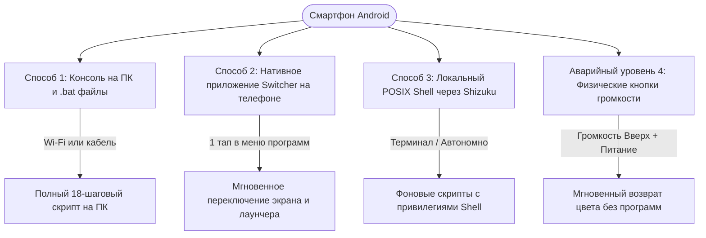
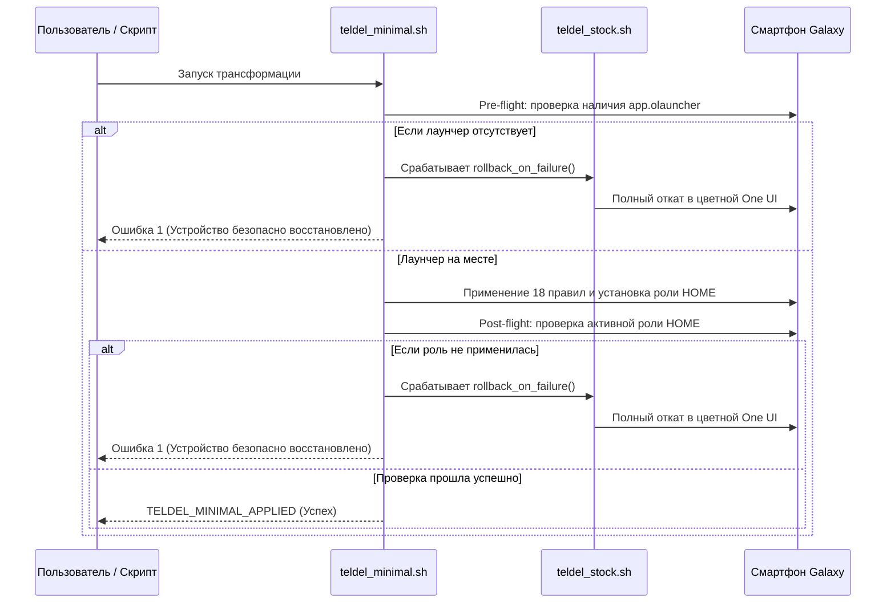

# teldel — Полное руководство пользователя и инструкция по эксплуатации

Добро пожаловать в официальное и подробное руководство пользователя **teldel** (Android Productivity Terminal & Dopamine Detox Suite). В этом документе подробно описаны все возможности, функции, способы подключения, автономные переключатели на телефоне и действия при нештатных ситуациях.

---

## Содержание

1. [Философия системы и гарантии безопасности](#1-философия-системы-и-гарантии-безопасности)
2. [Первоначальная подготовка устройства (5 минут)](#2-первоначальная-подготовка-устройства-5-минут)
3. [Три способа управления и переключения режимов](#3-три-способа-управления-и-переключения-режимов)
   - [Способ 1: Консоль на ПК и bat-файлы в 1 клик (Wi-Fi / USB)](#способ-1-консоль-на-пк-и-bat-файлы-в-1-клик-wi-fi--usb)
   - [Способ 2: Автономное приложение на телефоне (Teldel Switcher APK)](#способ-2-автономное-приложение-на-телефоне-teldel-switcher-apk)
   - [Способ 3: Автономный POSIX Shell на устройстве (Shizuku + Rish)](#способ-3-автономный-posix-shell-на-устройстве-shizuku--rish)
   - [Аварийный уровень 4: Физические аппаратные кнопки телефона](#аварийный-уровень-4-физические-аппаратные-кнопки-телефона)
4. [Подробный разбор функций консоли (phone_manager.bat)](#4-подробный-разбор-функций-консоли-phone_managerbat)
5. [Быстрые файлы автоматизации (.bat)](#5-быстрые-файлы-автоматизации-bat)
6. [Беспроводной ADB Guardian: работа без кабеля](#6-беспроводной-adb-guardian-работа-без-кабеля)
7. [Транзакционная безопасность и авто-откат (Self-Healing Rollback)](#7-транзакционная-безопасность-и-авто-откат-self-healing-rollback)
8. [Анализ экранного времени и дофаминовой зависимости](#8-анализ-экранного-времени-и-дофаминовой-зависимости)
9. [Часто задаваемые вопросы (FAQ) и решение проблем](#9-часто-задаваемые-вопросы-faq-и-решение-проблем)

---

## 1. Философия системы и гарантии безопасности

Современный смартфон спроектирован так, чтобы удерживать внимание бесконечными триггерами: сверхъяркие OLED-цвета, алгоритмические ленты рекомендаций, красные бейджи на иконках и микроанимации.

Комплекс **teldel** отсекает все отвлекающие факторы и превращает смартфон Samsung Galaxy или любой современный Android в высокоскоростной продуктивный терминал:

* **Без Root-прав**: все манипуляции осуществляются через легитимные системные интерфейсы Android (`settings`, `cmd role`, `cmd appops`, `pm`).
* **Гарантия Samsung Knox 0x0**: загрузчик не разблокируется, кастомные прошивки не ставятся, аппаратный статус гарантии Knox остается нетронутым (`0x0`). Банковские приложения и Knox Secure Folder работают штатно.
* **Неприкосновенный контур первой необходимости**:
  * Входящие и исходящие звонки, SMS и экстренные службы не затрагиваются.
  * Мессенджеры (Telegram, WhatsApp, Signal, Viber, Discord) работают в обычном режиме.
  * Push-уведомления в верхней шторке приходят с полным текстом сообщений и кнопками действий.
  * Банки (Monobank, Приват24, Райффайзен и др.) и двухфакторные аутентификаторы (Google Authenticator, Bitwarden) функционируют полноценно.
  * Камера делает снимки в исходном высоком разрешении и в оригинальных цветах.
* **100% обратимость**: вернуться в исходное состояние One UI можно в любой момент одним нажатием.

---

## 2. Первоначальная подготовка устройства (5 минут)

Настройка выполняется всего один раз:

### Шаг 2.1: Включение меню разработчика
1. На телефоне откройте **Настройки** > **Сведения о телефоне** > **Сведения о ПО**.
2. Быстро нажмите на пункт **Номер сборки** 7 раз подряд, пока не появится сообщение *"Режим разработчика включен"*.
3. Вернитесь в главное меню настроек и прокрутите в самый низ — там появится пункт **Параметры разработчика**.

### Шаг 2.2: Включение отладки по USB
1. Откройте **Параметры разработчика**.
2. Найдите блок **Отладка** и активируйте тумблер **Отладка по USB**.
3. (Рекомендуется для Android 11+): Также активируйте пункт **Беспроводная отладка** (Wireless debugging).

### Шаг 2.3: Авторизация компьютера
1. Подключите телефон к компьютеру кабелем USB.
2. На экране телефона появится запрос: *"Разрешить отладку по USB с этого компьютера?"*.
3. Поставьте галочку **Всегда разрешать с этого компьютера** и нажмите **Разрешить**.

---

## 3. Три способа управления и переключения режимов

В проекте реализовано три независимых контура переключения между **Минималистичным терминалом** и **Стандартным One UI**:



---

### Способ 1: Консоль на ПК и bat-файлы в 1 клик (Wi-Fi / USB)

Основной способ при работе за компьютером. Кабель нужен только один раз для первой активации, дальше все работает по Wi-Fi.

* **Главный интерфейс**: запустите `phone_manager.bat` двойным кликом.
* **Автоматический поиск по Wi-Fi**: если кабель не подключен, скрипты сами находят телефон в локальной сети по протоколам mDNS ZeroConf и ARP-сканированию подсети. Вручную прописывать IP-адреса не требуется.

---

### Способ 2: Автономное приложение на телефоне (Teldel Switcher APK)

Основной способ в повседневной жизни, когда компьютера нет рядом. В списке приложений на телефоне появляются две кнопки:

1. **"Switch to Stock"** (иконка One UI):
   * Моментально возвращает цветной экран (выключает монохром, отключает дальтонизм и Extra Dim).
   * Возвращает плавные системные анимации 1.0x.
   * Переключает рабочий стол на домашний экран Samsung One UI.
   * В фоне размораживает Google Play Store, Galaxy Store, Chrome и системные компоненты.
2. **"Switch to Minimal"** (иконка терминала):
   * Моментально переводит экран в аппаратный монохром.
   * Активирует затемнение ярких белых пикселей (Extra Dim) на 80%.
   * Ставит длительность анимаций в 0.0 мс для моментального отклика.
   * Переключает рабочий стол на текстовый минималистичный Olauncher.
   * Блокирует браузеры, магазины приложений и развлекательные ленты.

#### Архитектура Dual-Engine (Два независимых движка)
* **Движок A (Direct `WRITE_SECURE_SETTINGS`)**: использует выданные системные разрешения для прямого изменения настроек экрана через Android ContentResolver. Срабатывает мгновенно (менее 50 мс). **Не слетает после перезагрузки** — не требует повторного ввода кодов сопряжения или подключения к ПК.
* **Движок B (Shizuku Privileged IPC)**: если на устройстве запущен сервис Shizuku, приложение в фоновом потоке выполняет глубокую заморозку пакетов (`pm disable-user`) и атомарное переключение роли лаунчера (`android.app.role.HOME`).

---

### Способ 3: Автономный POSIX Shell на устройстве (Shizuku + Rish)

Для продвинутых пользователей, терминала Termux или автоматизаций Tasker:

* `/data/local/tmp/run_stock.sh` — скрипт полного отката к стоковому One UI прямо из памяти телефона.
* `/data/local/tmp/run_minimal.sh` — скрипт применения 18-шагового минимализма.

Скрипты уже развернуты в `/data/local/tmp/` с правами исполнения (`chmod 755`).

---

### Аварийный уровень 4: Физические аппаратные кнопки телефона

Если компьютер выключен, интернета и Wi-Fi нет, а приложение не запущено, в Samsung One UI есть встроенный аппаратный байпас:

1. Одновременно нажмите **Громкость Вверх + Боковая клавиша (Питание)**.
2. Это активирует системную комбинацию **Прямой доступ (Direct Access)**, которая мгновенно отключает монохром и Extra Dim, возвращая полноценный цветной экран.
3. **Настройка (делается один раз)**: **Настройки** > **Специальные возможности** > **Дополнительные параметры** > **Клавиши "Питание" и "Громкость вверх"** -> отметить галочками **Настройка цвета** и **Экстра-затемнение**.

---

## 4. Подробный разбор функций консоли (phone_manager.bat)

При запуске `phone_manager.bat` в верхней части окна отображается актуальное состояние телефона в реальном времени:

```text
================================================================
       ANDROID PRODUCTIVITY TERMINAL - PHONE MANAGER
================================================================
 [STATUS] Link: [Wi-Fi Wireless] | Bat: 100% | Mode: [MINIMAL TERMINAL]
          Screen: [B/W] | Store: [LOCKED] | DNS: [CleanBrowsing DoT]
================================================================
```

### Пункты меню:

* **`[1] Temporarily ENABLE Google Play Store`**:
  * Размораживает Google Play Store (`pm enable com.android.vending`).
  * Используйте, когда необходимо обновить банковское приложение, мессенджер или рабочую программу.
* **`[2] DISABLE Google Play Store`**:
  * Замораживает Google Play Store (`pm disable-user --user 0 com.android.vending`).
  * Закрывает контур от импульсивной установки игр и социальных сетей.
* **`[3] Mirror Phone Screen to PC (scrcpy)`**:
  * Запускает окно трансляции экрана телефона на монитор компьютера через `scrcpy`.
  * Позволяет печатать длинные тексты с физической клавиатуры ПК и управлять телефоном мышью.
* **`[4] Toggle Display Mode: B/W <--> COLOR`**:
  * Быстро переключает цветной и монохромный режим без изменения других программ и настроек.
* **`[5] Express Battery, RAM & Security Perimeter Audit`**:
  * Экспресс-аудит безопасности: заряд батареи, использование оперативной памяти, статус защищенного DoT DNS и проверка блокировки установки сторонних APK.
* **`[6] Apply Full Minimalism Transformation`**:
  * Применяет полный 18-шаговый транзакционно-безопасный профиль минимализма (отключение развлекательных пакетов, блокировка боковой загрузки, настройка Olauncher, шифрованный DNS).
* **`[7] Collect Usage Statistics & Dopamine Addiction Audit`**:
  * Выгружает данные системной службы `usagestats`, считает суммарное экранное время, количество запусков приложений, микро-проверки и непрерывные сессии зависания.
* **`[8] Open Interactive HTML Reports & Dashboard`**:
  * Открывает интерактивные графики и отчеты в вашем браузере на ПК (`docs/index.html`).
* **`[9] Restore Default Stock Android Settings (Rollback)`**:
  * Полный откат всех настроек, лаунчера, системных магазинов и анимаций к заводскому состоянию One UI.
* **`[W] Wireless ADB Menu`**:
  * Меню беспроводного управления: перевод телефона в режим Wi-Fi по порту 5555, сопряжение по коду Android 11+ и отключение сессий.
* **`[0] Exit`**:
  * Выход из консоли.

---

## 5. Быстрые файлы автоматизации (.bat)

Для ежедневного использования созданы ярлыки в папке `scripts/` и корне проекта:

| Файл | Назначение | Когда использовать |
| :--- | :--- | :--- |
| `scripts/apply_minimalism.bat` | Включение минимального режима | Двойной клик — за 5 секунд переводит телефон в терминал (работает по Wi-Fi или проводу). |
| `scripts/restore_defaults.bat` | Полный возврат к стоковому One UI | Двойной клик — моментально возвращает цветной One UI и приложения. |
| `connect_wireless.bat` | Беспроводное подключение ПК к телефону | Запустите, если хотите управлять телефоном без проводов. |
| `disconnect_wireless.bat` | Завершение беспроводного сеанса | Запустите перед подключением к публичным сетям Wi-Fi (кафе, отели). |
| `scripts/collect_stats.bat` | Сбор статистики использования | Обновляет аналитические JSON-файлы для графиков. |

---

## 6. Беспроводной ADB Guardian: работа без кабеля

Модуль `scripts/wifi_guardian.ps1` избавляет от типичных проблем беспроводного ADB:

### Динамическое авто-обнаружение без смены IP-адресов
Обычный Wi-Fi ADB перестает работать, как только роутер выдает телефону новый IP-адрес. В `teldel` встроен трехступенчатый поиск:
1. **Ступень 1 (Кэш)**: быстрая проверка сохраненного IP из `data/wireless_config.json`.
2. **Ступень 2 (mDNS)**: поиск сетевой службы Android 11+ (`_adb-tls-connect._tcp`).
3. **Ступень 3 (ARP-сканирование)**: сканирование локальной подсети (`arp -a`) и проверка порта 5555.

### Как включить режим без кабеля в первый раз:
1. Подключите телефон кабелем USB к компьютеру один раз.
2. Запустите `phone_manager.bat`, нажмите `W`, затем выберите `[1] Switch USB to Wireless Mode`.
3. Отключите провод. Телефон готов к полностью беспроводному управлению.

---

## 7. Транзакционная безопасность и авто-откат (Self-Healing Rollback)

Чтобы исключить риск зависания телефона в полунастроенном состоянии при сбое, введена транзакционная защита:



Если на любом шаге произойдет сбой, система **никогда** не оставит телефон с черным экраном или без рабочего стола: скрипт мгновенно откатит устройство к стоковому One UI.

---

## 8. Анализ экранного времени и дофаминовой зависимости

Аналитический модуль оценивает цифровые привычки:

1. Запустите `scripts/collect_stats.bat` (или пункт `[7]` в `phone_manager.bat`).
2. Модуль обработает данные `usagestats` и создаст три файла в папке `data/`:
   * `parsed_stats.json` — суммарное время и счетчики открытий приложений.
   * `multi_interval_stats.json` — распределение по дням, неделям и месяцам.
   * `deep_dopamine_analysis.json` — выявление компульсивных паттернов:
     * **Микро-проверки**: разблокировка и открытие приложений менее чем на 45 секунд.
     * **Сессии зависания (Binge sessions)**: непрерывное залипание более 45 минут подряд.
3. Откройте `docs/index.html` или `docs/dopamine_interactive_dashboard.html`, чтобы изучить интерактивные графики.

---

## 9. Часто задаваемые вопросы (FAQ) и решение проблем

#### Вопрос: В консоли пишет «Bat: 100%», это баг?
**Ответ**: Нет, это реальный заряд. В минималистичном режиме отключены фоновые сканирования радиомодулей, анимации и тяжелые фоновые сервисы Google/TikTok, а экран затемнен. Ток утечки в режиме ожидания составляет всего 5–12 мА. При емкости аккумулятора 5000 мАч телефону требуется несколько часов простого сна, чтобы заряд снизился со 100% до 99%.

#### Вопрос: Как срочно установить нужное приложение?
**Ответ**:
1. Откройте `phone_manager.bat` и нажмите `[1] Temporarily ENABLE Google Play Store`.
2. На телефоне зайдите в Google Play, установите необходимое приложение.
3. Вернитесь в консоль и нажмите `[2] DISABLE Google Play Store`, чтобы снова закрыть контур.

#### Вопрос: Телефон перезагрузился и экран снова стал цветным. Что делать?
**Ответ**: При полной перезагрузке система Android сбрасывает аппаратные параметры дальтонизма в целях безопасности. Просто нажмите на телефоне кнопку **"Switch to Minimal"** в меню приложений или запустите `scripts/apply_minimalism.bat` на ПК — монохром вернется за секунду.

#### Вопрос: Влияет ли это на гарантию или статус Samsung Knox?
**Ответ**: Нет. Статус Knox остается строго `0x0`. Все настройки применяются исключительно в пользовательском пространстве через системные API Android, без модификации загрузчика или прошивки.
